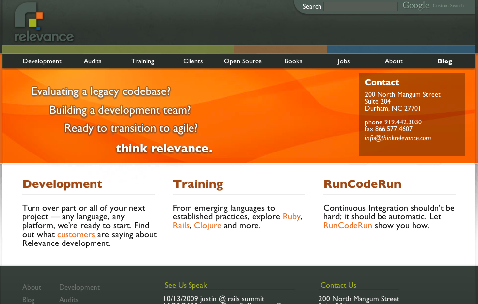
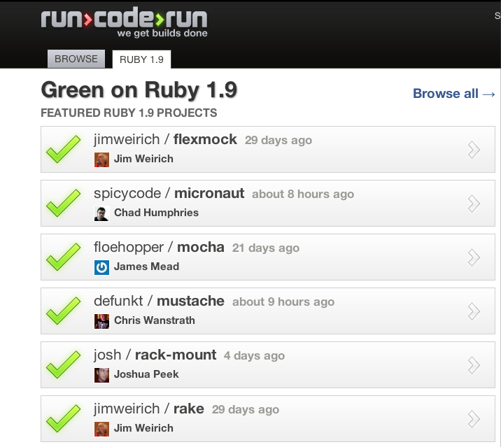
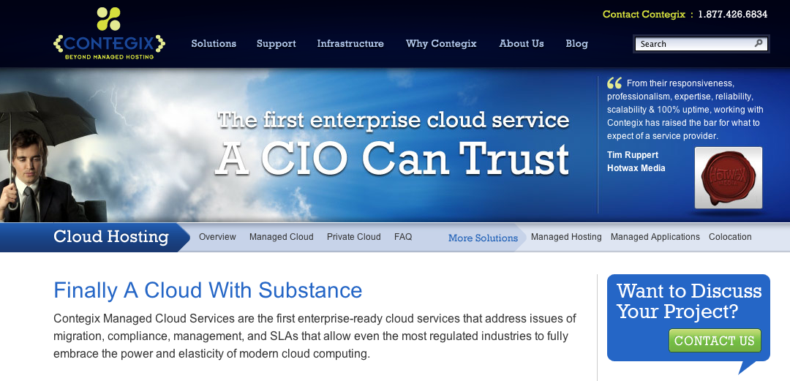
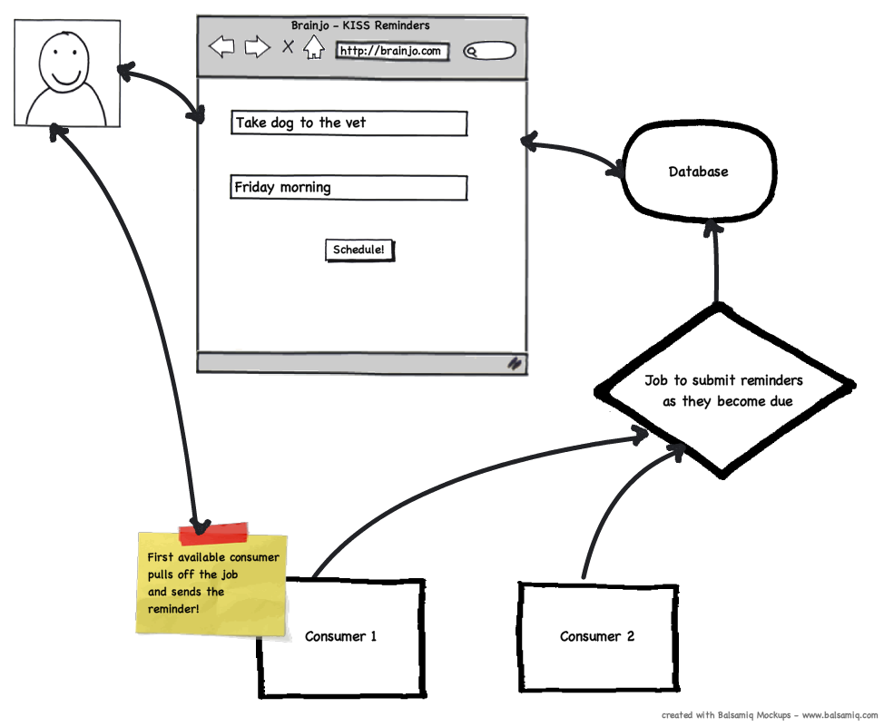
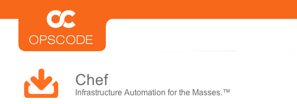

!SLIDE
 
# The Cloud:
# Real World Applications and Pragmatics

!SLIDE

# Please allow myself to introduce...myself

!SLIDE

!SLIDE

!SLIDE

!SLIDE

# "The Cloud" in 2009 == 

# "Ajax" in 2005

!SLIDE

# Substance behind the hype

* Ajax changed user experience
* Cloud changing how we build, deploy, and scale

!SLIDE

<!-- Nothing new under the sun -->

<a rel="cc:attributionURL" href="http://www.flickr.com/photos/wili/157232714/" class="cite" style="font-size:40%">http://www.flickr.com/photos/wili/157232714/</a>

!SLIDE

# Old Principles, Modern Application

* automation - of everything !
* small pieces, loosely joined <!-- thru very old tech - messaging - and of course services etc -->
* production readiness throughout

!SLIDE

<a rel="cc:attributionURL" href="http://www.flickr.com/photos/spaunsglo/">http://www.flickr.com/photos/spaunsglo/</a> / <a rel="license" href="http://creativecommons.org/licenses/by-nc-nd/2.0/">creative commons BY-NC-ND 2.0</a>
</cite>

 

# Introducing Braincron

!SLIDE

# What?

* Super simple app to send reminders
* Two core functions:
  * Enter requested reminders - examples:
      * _"Mail movies back to Netflix next Monday"_
      * _"Buy Flower for anniversary September 15"_

  * Send reminders via communication medium of choice

!SLIDE

# How?

* Two decoupled concerns
* Typical monolithic app does not fit
  * CRUD is on demand; sending is based on a schedule
  * CRUD is easy; sending can fail in countless ways

!SLIDE

!SLIDE

# Architecture

* Two applications
* Message Queue in the middle
* Scaling story: add consumers

!SLIDE

# Perfect use case for the cloud

!SLIDE

# Problem

* How to setup and administer instances?  
* What good is the cloud if we don't "auto-scale"?
* The answer: Automate it.  All of it.

<!-- 
  In the old world, the scaling story would have required manual effort
  OR if you were lucky, a collection perl or bash scripts from a dedicated
  sysadmin.  It still would have taken many hours, much trial + error,
  and much fear to go from 2 consumers to 10, or 100.
 -->

!SLIDE

 
 

<!-- * Why Chef?  Because it lets you automate sysadmin that way a good developer should
* Background
  * System Configuration Management
  * Alternatives: Puppet, others... -->

!SLIDE

# _Excuse me while I deploy everything, with one command_

* Ruby + Rails
* Apache
* Passenger
* Gems
* Postgres
* Consumers

<!-- * Why not...
  * Manual? - duh
  * Bash Scripts - fragile, tightly coupled, hard to write
  * AMIs/VMDKs/etc? - slow, very hard to get right, can't easily tweak/iterate as you go on -->

!SLIDE
  
# Chef Power
  * Declarative; therefore, Awesome
  * Ruby DSL, but you don't need to know Ruby
  * Describe how you want your system setup - Chef makes it so
  * Don't worry about how its done
  * Idempotent  

!SLIDE

@@@ ruby
    include_recipe "rails"
    include_recipe "apache2"
    include_recipe "passenger_apache2"
    include_recipe "passenger_apache2::mod_rails"

    apache_site "000-default" do
      enable false
    end

    web_app "braincron" do
      docroot "#{app_root}/braincron/current/public"
      server_name "braincron.#{node[:domain]}"
      server_aliases [ "braincron", node[:hostname] ]
      rails_env "production"
      template "braincron.conf.erb"
    end
@@@

!SLIDE

@@@
    <VirtualHost *:80>
      ServerName <%= @params[:server_name] %>
      ServerAlias <% @params[:server_aliases].each do |a| %><%= "#{a}" %> <% end %>
      DocumentRoot <%= @params[:docroot] %>

      RailsBaseURI /
      RailsEnv <%= @params[:rails_env] %>
      PassengerMaxPoolSize <%= @node[:rails][:max_pool_size] %>

      <Directory <%= @params[:docroot] %>>
        Order allow,deny
        Allow from all
      </Directory>

      ErrorLog <%= @node[:apache][:log_dir] %>/<%= @params[:name] %>-error.log
      CustomLog <%= @node[:apache][:log_dir] %>/<%= @params[:name] %>-access.log combined
    </VirtualHost>
@@@

!SLIDE

# Small Pieces, Loosely Joined

<!-- 
  We need our application to be designed as small pieces, loosely joined
  Why?  So we can scale up parts that need to be scaled independently 
  So each component is easily tested in isolation and only as complex as necessary, and no more
-->

!SLIDE

# Macro Level:

* Front end and back end 
* Two explicit parts

!SLIDE

# Micro Level

* Reuse OSS components wherever sensible
* Chatterbox wiring notifications together
* Rosetta Queue wrapping queue details

!SLIDE

# Benefits

  * Consumer maintenance / upgrades easy to do
  * Do not affect end users
  * We can add additional consumers on the fly

<!-- __In fact, lets do that right now__ -->

!SLIDE

# Production Readiness

!SLIDE

# Lets Just Be Clear

* Tradeoffs!
  * Flexibility and power for simplicity
  * More pieces = more integration

!SLIDE

# Testing

* Unit level (of course)
* Integration
  * Full stack wherever possible
* Continuous Integration
  
  
!SLIDE

# Monitoring

* Monitoring in place from day one
  * Can be simple: 
  * Scout, Nagios, JMX
  
!SLIDE

# Error Handling

* Always fail fast
* Aggressive Exception notifications
* Analytics
    * Timing taken on every message processed on back end

!SLIDE

# Resources

* <a href="http://www.amazon.com/gp/product/0978739213?ie=UTF8&tag=panasonicyout-20&linkCode=as2&camp=1789&creative=9325&creativeASIN=0978739213">Release It!: Design and Deploy Production-Ready Software</a>

* <a href="http://www.amazon.com/gp/product/0596102356?ie=UTF8&tag=panasonicyout-20&linkCode=as2&camp=1789&creative=9325&creativeASIN=0596102356">Building Scalable Web Sites</a>

* [HighScalability.com](http://highscalability.com/)

* [Chef Resources - basic unit of work in Chef](http://wiki.opscode.com/display/chef/Resources)

* [Opscode Cookbooks](http://github.com)

* [Rob @ Github](http://github.com/rsanheim)

!SLIDE

# Conclusion

<!-- This isn't the only way to build an app for the cloud.  But it is one that can maximize the benefits and advantages of the cloud, letting you scale up and down and maintain it all while doing so.  These aren't new principles, but its a perfect time for them to come together and become truly effective for cloud based apps.  Now go build stuff, and prosper. -->